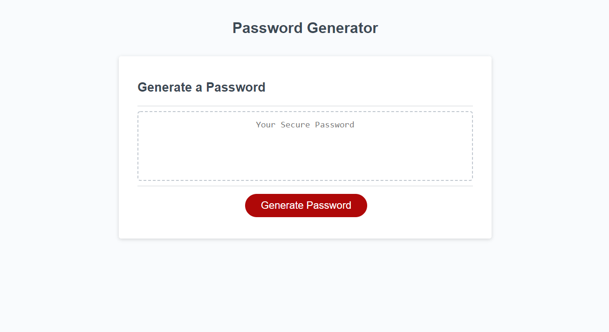

# Password Generator

*Password Generator is a website that allows a user to generate a random password that is between 8 and 128 characters in length.  The user is also able to select the types of characters the password will contain, and has the option to select uppercase letters, lowercase letters, numbers, and special characters*

## Technologies Used

The following technologies were used to create this page.

* HTML
* CSS
* Javascript

## Website

https://alex-kress.github.io/password-generator/

## Project Description

This website was created by adding Javascript to pre-exsting HTML and CSS.

The added Javascript identified array variables to allow the password to contain the various types of characters.  It also added pop-up windows to the website so that when the user clicks the generate button, the following takes place:

The user is prompted to input the number of characters they want their password to contain, in a prompt window.

The user then indicates which types of characters they want used, through a series of four confirm windows that pop up.

Once this is completed, the generatePassword function uses if functions and a for loop to generate the password, and the user is able to see their password displayed in a box on the main page of the website.

